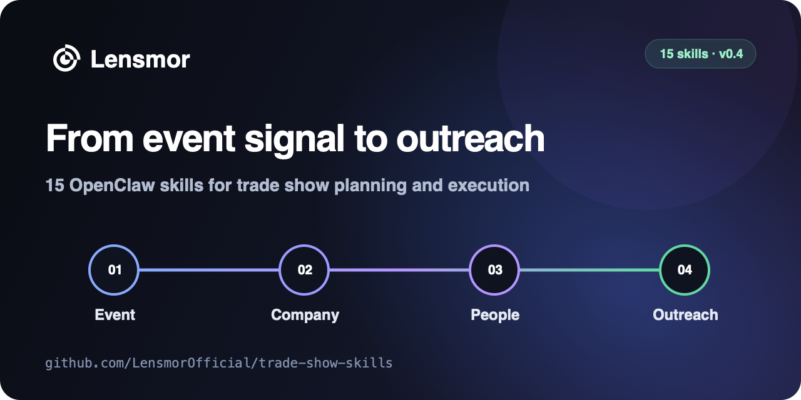

<p align="center">
  <a href="https://clawhub.ai/weilun88313/trade-show-finder">
    
  </a>
</p>

# Trade Show Skills for OpenClaw

<p align="center">
  <a href="https://clawhub.ai/weilun88313/trade-show-finder"><strong>Install from ClawHub</strong></a>
  ·
  <a href="https://app.lensmor.com/signup?utm_source=github&utm_medium=readme&utm_campaign=trade-show-skills"><strong>Start Lensmor free</strong></a>
  ·
  <a href="https://api.lensmor.com/?utm_source=github&utm_medium=readme&utm_campaign=trade-show-skills"><strong>API Docs</strong></a>
  ·
  <a href="https://calendly.com/shirleyan_lensmor/30min?utm_source=github&utm_medium=readme&utm_campaign=trade-show-skills"><strong>Book a demo</strong></a>
</p>

[](https://github.com/LensmorOfficial/trade-show-skills/stargazers)
[](https://github.com/LensmorOfficial/trade-show-skills/commits/main)
[](LICENSE)
[](https://github.com/LensmorOfficial/trade-show-skills/releases)

**If you find these skills useful, please star this repo — it helps others discover them.**

> 15 reusable OpenClaw skills for trade show selection, pre-show GTM, on-site execution, and post-show follow-up.

Move from event signal → company → people → outreach. These skills give [OpenClaw](https://openclaw.ai) structured workflows for show selection, exhibitor research, budget planning, pre-show outreach, on-site execution, and post-show follow-up.

## Try It in 60 Seconds

Install the show-selection skill:

```bash
npx openclaw@latest skills install @weilun88313/trade-show-finder --acknowledge-clawhub-risk
```

Then ask OpenClaw:

```
Should we exhibit at MEDICA 2026? We sell surgical workflow software to 200+ bed hospitals in DACH.
```

The agent will verify the current edition, score show fit against your ICP and goal, recommend `Exhibit` / `Attend only` / `Skip`, and hand you off to budgeting or outreach next steps.

Most planning and execution skills work without a Lensmor API key. Data-backed skills are clearly labeled and require Lensmor API access.

Other examples of what you can do with these skills:

| Prompt | Skill Used | What You Get |
|--------|------------|--------------|
| "Compare Interpack and PACK EXPO for a DACH packaging SaaS vendor" | trade-show-finder | Show fit scores, winner recommendation, and exhibit/attend guidance |
| "Write a booth invite email for MEDICA, booth 5C42" | booth-invitation-writer | Subject line + body under 150 words, with A/B variant |
| "We got 200 leads at Interpack, write follow-up emails" | post-show-followup | 3-tier sequence (hot/warm/cold) with send-timing guide |
| "Plan a $40K budget for exhibiting at Hannover Messe" | trade-show-budget-planner | Line-item budget, ROI model, and cost benchmarks |
| "What giveaways should we bring to SaaStr, budget $8/item, selling to CTOs" | booth-giveaway-planner | 5–8 branded gift ideas with rationale, cost, and visitor targeting |
| "Write booth scripts for our team at MEDICA — cold walk-ups and warm leads" | booth-script-generator | Per-visitor-type scripts: openings, pitches, qualification questions, CTAs |
| "Generate our MEDICA prep checklist, 20sqm custom booth, 4 staff from London" | exhibitor-checklist-generator | Phased checklist with owners and deadlines, paste directly into any PM tool |

## Table of Contents

- [Try It in 60 Seconds](#try-it-in-60-seconds)
- [Available Skills](#available-skills)
- [Quick Start](#quick-start)
- [End-to-End Lifecycle Example](#end-to-end-lifecycle-example)
- [How It Works](#how-it-works)
- [About Lensmor](#about-lensmor)
- [Related Repositories](#related-repositories)
- [Contributing](#contributing)
- [License](#license)

## Available Skills

### Pre-Show

| Skill | Description | Use When |
|-------|-------------|----------|
| [trade-show-finder](trade-show-finder/) | Score and prioritize trade shows for exhibiting based on ICP, region, and goals | Choosing where to exhibit, comparing shows, planning an annual show calendar |
| [trade-show-budget-planner](trade-show-budget-planner/) | Build exhibition budgets and ROI projections with cost benchmarks | Budget planning, ROI analysis, investment justification |
| [pre-show-competitor-analysis](pre-show-competitor-analysis/) | Analyze competitor exhibitor lists and booth positioning to inform strategy and messaging | Threat scoring, differentiation planning, counter-messaging before the show |
| [booth-invitation-writer](booth-invitation-writer/) | Generate personalized pre-show invitation emails and outreach sequences | Driving booth traffic, scheduling meetings, pre-show outreach |
| [booth-giveaway-planner](booth-giveaway-planner/) | Plan trade show giveaways matched to your ICP, budget, and product story | Choosing branded gifts, budget allocation, pre-show ordering |
| [exhibitor-checklist-generator](exhibitor-checklist-generator/) | Generate a phased exhibitor prep checklist with owners and deadlines | Show preparation planning, team task assignment, first-time exhibitors |
| [trade-show-fit-score](trade-show-fit-score/) | Score a specific trade show against your company profile using the Lensmor API | Data-backed exhibit vs. skip decisions, annual planning triage, internal budget justification |
| [trade-show-exhibitor-search](trade-show-exhibitor-search/) | Find ICP-matching exhibitors at a specific trade show using the Lensmor API | Pre-show prospecting, competitive mapping, partner discovery |
| [trade-show-lead-recommender](trade-show-lead-recommender/) | Get AI-recommended exhibitors matching your ICP for a specific trade show event | AI-driven account prioritization, turning a 500-company exhibitor list into a top-20 outreach shortlist |
| [trade-show-contact-finder](trade-show-contact-finder/) | Find decision-makers and key contacts at target exhibitor companies using the Lensmor API | Pre-show decision-maker lookup, booth meeting scheduling, account-based contact lists |
| [competitor-show-tracker](competitor-show-tracker/) | Rank upcoming trade shows by how many of your competitors are exhibiting there | Competitive show circuit mapping, counter-programming decisions, budget prioritization |

### On-Site

| Skill | Description | Use When |
|-------|-------------|----------|
| [badge-qualifier](badge-qualifier/) | Qualify leads from booth notes, badge scans, or voice transcripts into a structured CRM-ready record | Real-time lead scoring on the show floor, batch-qualifying end-of-day leads |
| [trade-show-competitor-radar](trade-show-competitor-radar/) | Structure competitor booth observations into field-intel notes with evidence/inference separation | Documenting competitor launches, pricing signals, and positioning shifts at the show |
| [booth-script-generator](booth-script-generator/) | Generate booth conversation scripts tailored to each visitor type | Staff training, first-time exhibitors, refreshing pitch for a new show |

See [docs/on-site.md](docs/on-site.md) for on-site workflow guidance.

### Post-Show

| Skill | Description | Use When |
|-------|-------------|----------|
| [post-show-followup](post-show-followup/) | Create tiered post-show follow-up email sequences | Converting leads post-event, lead nurture, thank-you emails |

## Quick Start

### Install with OpenClaw

```bash
# Install one verified ClawHub release into the current OpenClaw workspace
openclaw skills install @weilun88313/trade-show-finder --acknowledge-clawhub-risk

# Example: install the on-site competitor intel skill
openclaw skills install @weilun88313/trade-show-competitor-radar --acknowledge-clawhub-risk
```

Using OpenClaw's native installer preserves the release owner and integrity metadata that `openclaw skills info` uses to verify the installed package. If you are not sure which slug you need, browse [ClawHub](https://clawhub.ai) or search from the CLI:

```bash
openclaw skills search "trade show"
```

### Install a single skill

```bash
git clone https://github.com/LensmorOfficial/trade-show-skills.git

# Install to current workspace
cp -r trade-show-skills/trade-show-finder <your-workspace>/skills/

# Or install to shared location (available in all OpenClaw workspaces)
cp -r trade-show-skills/trade-show-finder ~/.openclaw/skills/
```

### Install all skills at once

```bash
git clone https://github.com/LensmorOfficial/trade-show-skills.git
for skill in trade-show-finder trade-show-budget-planner pre-show-competitor-analysis booth-invitation-writer booth-giveaway-planner exhibitor-checklist-generator badge-qualifier booth-script-generator trade-show-competitor-radar post-show-followup trade-show-fit-score trade-show-exhibitor-search trade-show-lead-recommender trade-show-contact-finder competitor-show-tracker; do
  cp -r trade-show-skills/$skill ~/.openclaw/skills/
done
```

Skills activate automatically when your prompt matches their description.

> **ClawHub**: All skills are published under [`@weilun88313`](https://clawhub.ai/weilun88313). Install any skill with OpenClaw's native installer:
> ```bash
> npx openclaw@latest skills install @weilun88313/trade-show-finder --acknowledge-clawhub-risk
> npx openclaw@latest skills install @weilun88313/trade-show-exhibitor-search --acknowledge-clawhub-risk
> npx openclaw@latest skills install @weilun88313/trade-show-fit-score --acknowledge-clawhub-risk
> npx openclaw@latest skills install @weilun88313/trade-show-contact-finder --acknowledge-clawhub-risk
> npx openclaw@latest skills install @weilun88313/trade-show-lead-recommender --acknowledge-clawhub-risk
> npx openclaw@latest skills install @weilun88313/competitor-show-tracker --acknowledge-clawhub-risk
> ```

## End-to-End Lifecycle Example

See [docs/event-lifecycle.md](docs/event-lifecycle.md) for a worked example showing the core lifecycle skills end to end, plus where the supporting planning and on-site skills fit.

## How It Works

Each skill is a self-contained directory with:
- `SKILL.md` — The skill definition (YAML frontmatter + workflow instructions)
- `README.md` — Documentation
- `examples/` — Sample inputs and outputs

When you ask the agent something that matches a skill's description (e.g., "should we exhibit at MEDICA 2026 for our ICP?"), the skill activates and guides the agent through a structured workflow.

## About Lensmor

[Lensmor](https://www.lensmor.com/?utm_source=github&utm_medium=readme&utm_campaign=trade-show-skills) is an AI-native event intelligence platform that helps B2B teams move from event discovery to prioritized accounts, relevant decision-makers, and pre-show outreach.

**[Start Lensmor free →](https://app.lensmor.com/signup?utm_source=github&utm_medium=readme&utm_campaign=trade-show-skills)**

## More Open Source from Lensmor

- [awesome-trade-shows](https://github.com/LensmorOfficial/awesome-trade-shows) — Curated list of 100+ trade shows across 15 industries
- [trade-show-calendar](https://github.com/LensmorOfficial/trade-show-calendar) — Open dataset of global trade shows (CSV + JSON)
- [exhibitor-intelligence-playbook](https://github.com/LensmorOfficial/exhibitor-intelligence-playbook) — Complete B2B trade show ROI playbook
- [event-tech-landscape](https://github.com/LensmorOfficial/event-tech-landscape) — Map of 80+ tools powering the event industry
- [trade-show-email-templates](https://github.com/LensmorOfficial/trade-show-email-templates) — Ready-to-use email templates for trade show outreach
- [trade-show-linkedin-templates](https://github.com/LensmorOfficial/trade-show-linkedin-templates) — 30+ LinkedIn message templates for pre-show outreach and post-show follow-ups

## Releases

Current release: **[v0.4.0](https://github.com/LensmorOfficial/trade-show-skills/releases/tag/v0.4.0)**. See [CHANGELOG.md](CHANGELOG.md) for what's included.

## Contributing

Have ideas for new skills or improvements? See [CONTRIBUTING.md](CONTRIBUTING.md) for conventions, authoring guidelines, and the review checklist.

- [CONTRIBUTING.md](CONTRIBUTING.md) — How to add or modify skills
- [docs/skill-quality-checklist.md](docs/skill-quality-checklist.md) — Pre-merge quality checklist
- [docs/publishing.md](docs/publishing.md) — Publishing and release quality guidance
- [docs/github-growth.md](docs/github-growth.md) — Maintainer measurement and release cadence

## License

[MIT](LICENSE)
