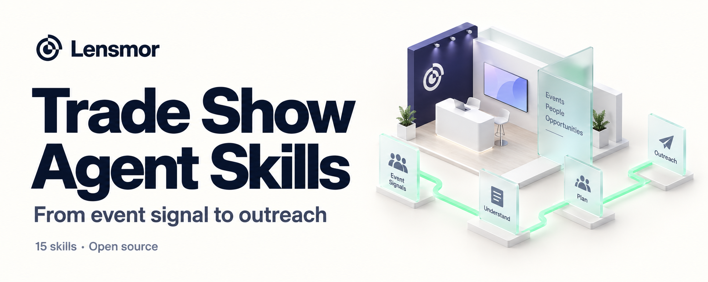

<p align="center">
  <a href="https://github.com/LensmorOfficial/trade-show-skills">
    
  </a>
</p>

# Trade Show Agent Skills

<p align="center">
  <a href="https://github.com/LensmorOfficial/trade-show-skills"><strong>Get the Skills</strong></a>
  ·
  <a href="https://app.lensmor.com/signup?utm_source=github&utm_medium=readme&utm_campaign=trade-show-skills"><strong>Start Lensmor free</strong></a>
  ·
  <a href="https://api.lensmor.com/?utm_source=github&utm_medium=readme&utm_campaign=trade-show-skills"><strong>API Docs</strong></a>
  ·
  <a href="https://calendly.com/shirleyan_lensmor/30min?utm_source=github&utm_medium=readme&utm_campaign=trade-show-skills"><strong>Book a demo</strong></a>
</p>

[](https://github.com/LensmorOfficial/trade-show-skills/stargazers)
[](https://github.com/LensmorOfficial/trade-show-skills/commits/main)
[](LICENSE)
[](https://github.com/LensmorOfficial/trade-show-skills/actions/workflows/repo-quality.yml)
[](https://github.com/LensmorOfficial/trade-show-skills/releases)

**If you find these skills useful, please star this repo — it helps others discover them.**

> 15 reusable Agent Skills for trade show selection, pre-show GTM, on-site execution, and post-show follow-up.

Move from event signal → company → people → outreach. These skills give AI agents structured workflows for show selection, exhibitor research, budget planning, pre-show outreach, on-site execution, and post-show follow-up.

## Try a Skill

Get the source, then load [trade-show-finder/SKILL.md](trade-show-finder/SKILL.md) in your agent or install its directory using the [quick start](#quick-start). Ask:

```text
Use trade-show-finder to compare two upcoming editions of relevant medical trade shows. We sell surgical workflow software to 200+ bed hospitals in DACH.
```

With access to current official web sources, the agent verifies the editions, evaluates fit against your ICP and goal, and recommends `Exhibit` / `Attend only` / `Skip`. If it cannot verify the evidence, it reports `Verification required`.

Ten planning and execution skills need no Lensmor API key. Five data-backed skills require `LENSMOR_API_KEY` and outbound HTTPS access. Tool availability, discovery paths, and activation behavior depend on your agent client.

Other examples of what you can do with these skills:

| Prompt | Skill Used | What You Get |
|--------|------------|--------------|
| "Compare Interpack and PACK EXPO for a DACH packaging SaaS vendor" | trade-show-finder | Show fit scores, winner recommendation, and exhibit/attend guidance |
| "Write a booth invite email for MEDICA, booth 5C42" | booth-invitation-writer | Subject line + body under 150 words, with A/B variant |
| "We got 200 leads at Interpack, write follow-up emails" | post-show-followup | 3-tier sequence (hot/warm/cold) with send-timing guide |
| "Plan a $40K budget for exhibiting at Hannover Messe" | trade-show-budget-planner | Line-item budget, ROI model, and cost benchmarks |
| "What giveaways should we bring to SaaStr, budget $8/item, selling to CTOs" | booth-giveaway-planner | 5–8 branded gift ideas with rationale, cost, and visitor targeting |
| "Write booth scripts for our team at MEDICA — cold walk-ups and warm leads" | booth-script-generator | Per-visitor-type scripts: openings, pitches, qualification questions, CTAs |
| "Generate our MEDICA prep checklist, 20sqm custom booth, 4 staff from London" | exhibitor-checklist-generator | Phased checklist with owners and deadlines, paste directly into any PM tool |

## Table of Contents

- [Try a Skill](#try-a-skill)
- [Available Skills](#available-skills)
- [Quick Start](#quick-start)
- [End-to-End Lifecycle Example](#end-to-end-lifecycle-example)
- [How It Works](#how-it-works)
- [About Lensmor](#about-lensmor)
- [Related Repositories](#related-repositories)
- [Contributing](#contributing)
- [License](#license)

## Available Skills

### Pre-Show

| Skill | Description | Use When |
|-------|-------------|----------|
| [trade-show-finder](trade-show-finder/) | Score and prioritize trade shows for exhibiting based on ICP, region, and goals | Choosing where to exhibit, comparing shows, planning an annual show calendar |
| [trade-show-budget-planner](trade-show-budget-planner/) | Build exhibition budgets and ROI projections with cost benchmarks | Budget planning, ROI analysis, investment justification |
| [pre-show-competitor-analysis](pre-show-competitor-analysis/) | Analyze competitor exhibitor lists and booth positioning to inform strategy and messaging | Threat scoring, differentiation planning, counter-messaging before the show |
| [booth-invitation-writer](booth-invitation-writer/) | Generate personalized pre-show invitation emails and outreach sequences | Driving booth traffic, scheduling meetings, pre-show outreach |
| [booth-giveaway-planner](booth-giveaway-planner/) | Plan trade show giveaways matched to your ICP, budget, and product story | Choosing branded gifts, budget allocation, pre-show ordering |
| [exhibitor-checklist-generator](exhibitor-checklist-generator/) | Generate a phased exhibitor prep checklist with owners and deadlines | Show preparation planning, team task assignment, first-time exhibitors |
| [trade-show-fit-score](trade-show-fit-score/) | Retrieve the API's 0–10 profile fit score and three returned dimensions for one event | Data-backed event triage and planning handoff |
| [trade-show-exhibitor-search](trade-show-exhibitor-search/) | List exhibitors for one event or run cross-event company discovery | Factual event research, prospect discovery, partner mapping |
| [trade-show-lead-recommender](trade-show-lead-recommender/) | Retrieve event recommendations and distinguish ranked matches from unranked fallback records | Evidence-gated account prioritization |
| [trade-show-contact-finder](trade-show-contact-finder/) | Find company contacts and report email/phone lock state without unlocking data | Pre-show decision-maker lookup and LinkedIn outreach planning |
| [competitor-show-tracker](competitor-show-tracker/) | Rank events by competitor-name matches in Lensmor exhibitor records | Competitive show-circuit mapping with explicit credit and activity logging |

### On-Site

| Skill | Description | Use When |
|-------|-------------|----------|
| [badge-qualifier](badge-qualifier/) | Qualify leads from booth notes, badge scans, or voice transcripts into a structured CRM-ready record | Real-time lead scoring on the show floor, batch-qualifying end-of-day leads |
| [trade-show-competitor-radar](trade-show-competitor-radar/) | Structure competitor booth observations into field-intel notes with evidence/inference separation | Documenting competitor launches, pricing signals, and positioning shifts at the show |
| [booth-script-generator](booth-script-generator/) | Generate booth conversation scripts tailored to each visitor type | Staff training, first-time exhibitors, refreshing pitch for a new show |

See [docs/on-site.md](docs/on-site.md) for on-site workflow guidance.

### Post-Show

| Skill | Description | Use When |
|-------|-------------|----------|
| [post-show-followup](post-show-followup/) | Create tiered post-show follow-up email sequences | Converting leads post-event, lead nurture, thank-you emails |

## Quick Start

These folders follow the [Agent Skills format](https://agentskills.io/specification): a `SKILL.md` with YAML frontmatter and Markdown instructions, plus examples and references where needed. They do not require a particular agent runtime.

### Install one skill

Clone the repository, inspect the skill, and copy its entire directory into a location your client discovers. For clients supporting project-level `.agents/skills/`, run from your project:

```bash
git clone https://github.com/LensmorOfficial/trade-show-skills.git
mkdir -p .agents/skills
cp -r trade-show-skills/trade-show-finder .agents/skills/
```

A shared `~/.agents/skills/` directory is also supported by some clients. Check your client's documentation for paths, reload behavior, and invocation syntax. To reproduce a tested revision, check out its commit or GitHub release before copying. Updating the checkout does not update copied skills automatically.

### Install all 15 skills

From the project containing your clone:

```bash
mkdir -p .agents/skills
for skill_file in trade-show-skills/*/SKILL.md; do
  cp -r "$(dirname "$skill_file")" .agents/skills/
done
```

### Prerequisites

- Writing and qualification skills can use user-supplied notes and facts. Research skills need current official sources through browsing tools or source material supplied by the user.
- `trade-show-fit-score`, `trade-show-exhibitor-search`, `trade-show-lead-recommender`, `trade-show-contact-finder`, and `competitor-show-tracker` require a Lensmor API key configured in the agent's execution environment. Each workflow checks for it before requesting data; `metadata.required-env` documents the requirement and does not automatically inject credentials.
- `competitor-show-tracker` uses charged requests and updates search activity. Its workflow requires a confirmed bounded budget before those requests. Installation alone grants no permission to spend credits, unlock records, or send outreach.

If your client does not support skill discovery, provide the chosen `SKILL.md` and any referenced resources as task instructions. The client still needs the tools required by that workflow.

See the [health-check guide](docs/health-check.md) and [2026-10-07 source audit](docs/health-audit-2026-10-07.md) for checks performed and outstanding validation. Older releases and external registry copies may contain earlier runtime-specific packaging and do not receive these source fixes automatically.

## End-to-End Lifecycle Example

See [docs/event-lifecycle.md](docs/event-lifecycle.md) for a worked example showing the core lifecycle skills end to end, plus where the supporting planning and on-site skills fit.

## How It Works

Each skill is a self-contained directory with:
- `SKILL.md` — The skill definition (YAML frontmatter + workflow instructions)
- `README.md` — Documentation
- `examples/` — Sample inputs and outputs

A skills-compatible client discovers each name and description, then loads the workflow when selected. You can also ask the agent explicitly to use a skill. Activation behavior depends on the client.

## About Lensmor

[Lensmor](https://www.lensmor.com/?utm_source=github&utm_medium=readme&utm_campaign=trade-show-skills) is an AI-native event intelligence platform that helps B2B teams move from event discovery to prioritized accounts, relevant decision-makers, and pre-show outreach.

**[Start Lensmor free →](https://app.lensmor.com/signup?utm_source=github&utm_medium=readme&utm_campaign=trade-show-skills)**

## More Open Source from Lensmor

- [awesome-trade-shows](https://github.com/LensmorOfficial/awesome-trade-shows) — Curated list of 100+ trade shows across 15 industries
- [trade-show-calendar](https://github.com/LensmorOfficial/trade-show-calendar) — Open dataset of global trade shows (CSV + JSON)
- [exhibitor-intelligence-playbook](https://github.com/LensmorOfficial/exhibitor-intelligence-playbook) — Complete B2B trade show ROI playbook
- [event-tech-landscape](https://github.com/LensmorOfficial/event-tech-landscape) — Map of 80+ tools powering the event industry
- [trade-show-email-templates](https://github.com/LensmorOfficial/trade-show-email-templates) — Ready-to-use email templates for trade show outreach
- [trade-show-linkedin-templates](https://github.com/LensmorOfficial/trade-show-linkedin-templates) — 30+ LinkedIn message templates for pre-show outreach and post-show follow-ups

## Releases

Current published GitHub release: **[v0.4.1](https://github.com/LensmorOfficial/trade-show-skills/releases/tag/v0.4.1)**. Source revisions on `main` may be newer; a GitHub merge does not update external registry packages or existing copied installations. See [CHANGELOG.md](CHANGELOG.md) for what's included.

## Contributing

Have ideas for new skills or improvements? See [CONTRIBUTING.md](CONTRIBUTING.md) for conventions, authoring guidelines, and the review checklist.

- [CONTRIBUTING.md](CONTRIBUTING.md) — How to add or modify skills
- [docs/skill-quality-checklist.md](docs/skill-quality-checklist.md) — Pre-merge quality checklist
- [docs/publishing.md](docs/publishing.md) — Publishing and release quality guidance
- [docs/health-check.md](docs/health-check.md) — Separate package, runtime, workflow, and live API checks
- [docs/github-growth.md](docs/github-growth.md) — Maintainer measurement and release cadence

## License

[MIT](LICENSE)
